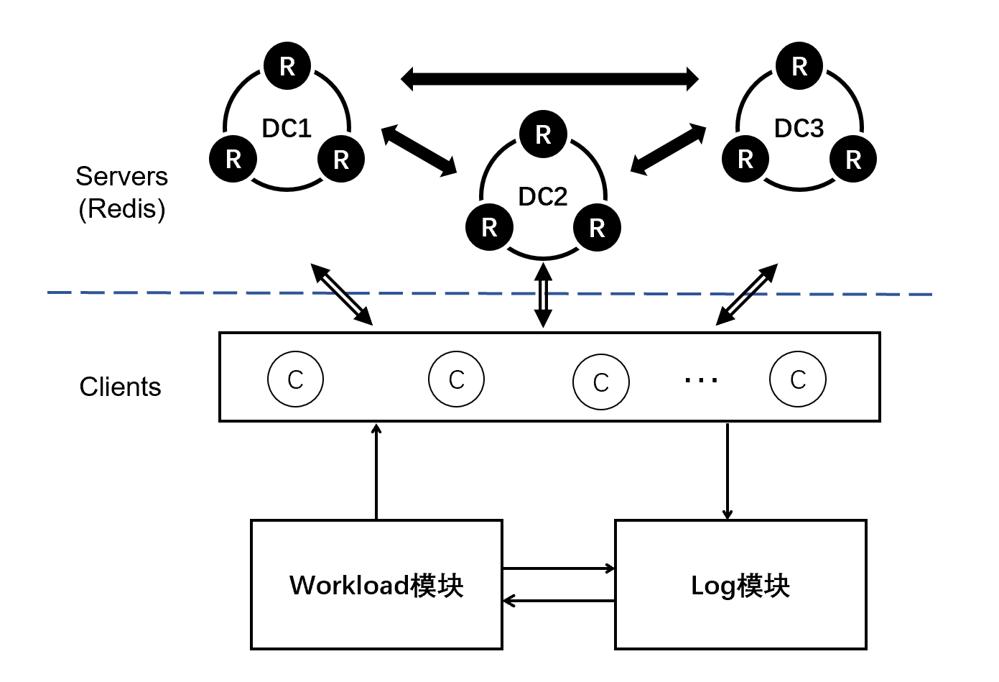

# 实验测试
## 依赖库
实验测试首先需要安装的依赖库如下所示
### C/C++ 库
* **hiredis**
### python 库
* **paramiko**
* **redis**
* **scp**

## 实验文件
实验文件主要包括三个文件夹
* *redis_test* : 测试脚本与Redis Server配置文件
  * **.sh* : 测试脚本文件
  * *connection.py* : 用于虚拟机或Docker的实验。 构建实验框架的服务器部分，在实验完成后将其关闭并清理。 它使用ssh来控制服务器VM启动它们的Redis实例，在它们之间建立对等复制模式，并设置它们之间的网络延迟。 实验完成后，关闭所有服务器并删除其.rdb和.log文件。 
* *bench* : 实验测试代码。 
  * *set* : 无冲突复制Set数据类型测试程序文件夹
  * *tree* : RWF-Tree数据类型测试程序文件夹
  * *exp_setting.h* : 运行实验。 启动客户端线程，调用生成器并定期从服务器读取数据。 
  * *main.cpp* : 实验主程序
  * *util.h* : 一些实用程序：随机生成器，redis客户端，redis回复。 以及CRDT实验的基本类别 
    * cmd : CRDT操作命令
    * generator : 操作命令生成器
    * rdt_log : 记录操作命令，读取Redis实例的数据。实验完成后将原始数据写入*result*文件夹
* *result* : 实验数据文件夹
  * *process* : 数据处理程序文件夹
  * *RawData* : 原始数据文件夹

## 实验架构

我们在docker上运行所有服务器节点和客户端节点。Redis服务器被划分为3个数据中心， 每个数据中心都有1-5个Redis实例。 我们通过为不同类型的连接指定不同的本地主机IP来实现此目的。
<div align=center></div>

## 实验测试

测试前，首先需要[编译项目](../redis-4.0.8/README.md##项目编译)。
然后启动docker环境
```bash
cd docker
sh ./start.sh
```

再编译运行实验测试程序：
```bash
cd bench
make
./bench_start
```

实验测试结束后，实验的原始数据存放于 *experiment/bench/result* 文件夹中，可以使用 *experiment/bench/result/process* 文件夹中的python文件进行处理分析